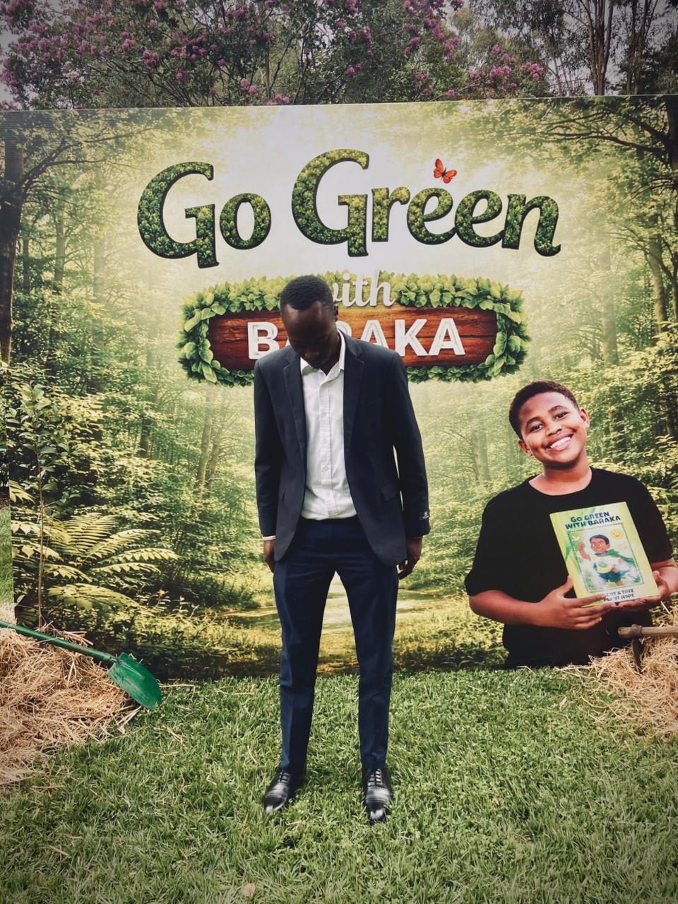

Today I had the privilege of attending the official launch of **Go Green With Baraka**, one of the most inspiring initiatives I have come across in a long time — and it is being led by an 11-year-old.

{width=65% fig-align="center"}

## Meet Baraka

Baraka is an 11-year-old environmental advocate who has already planted **8,900 trees**. Let that number sink in. While most of us talk about climate action, Baraka has been out in the field, quite literally, getting his hands in the soil and making a measurable difference for Kenya's environment.

His initiative, **Go Green With Baraka**, is built around a simple but powerful idea: that young people can — and should — lead the charge in protecting our planet. Baraka even authored a children's book, *Go Green With Baraka*, to inspire other kids to plant trees and take care of the environment around them.

## The Launch

The event was warm, energetic, and full of hope. The backdrop said it all — a lush green forest scene, a reminder of what we are fighting to preserve and restore. There was a real sense that something meaningful was beginning, not just a campaign, but a movement rooted in youthful conviction.

It was humbling to be in a room where the keynote speaker hasn't even hit secondary school yet, and yet carries the moral weight of someone who has already done more for the environment than most adults ever will.

## Why This Matters

Kenya is facing real and urgent environmental challenges — deforestation, erratic rainfall, and land degradation. Every tree planted is a small act of resistance against these forces. Baraka's work is a reminder that meaningful climate action doesn't require waiting for governments or corporations to move first. It starts with one person, one seedling, one community at a time.

If an 11-year-old can plant nearly 9,000 trees, what is our excuse?

## Get Involved

If you want to follow Baraka's journey, support the initiative, or find out how to get involved in tree planting efforts, keep an eye out for **Go Green With Baraka** — because this is only the beginning.

Here's to a greener Kenya. 🌱